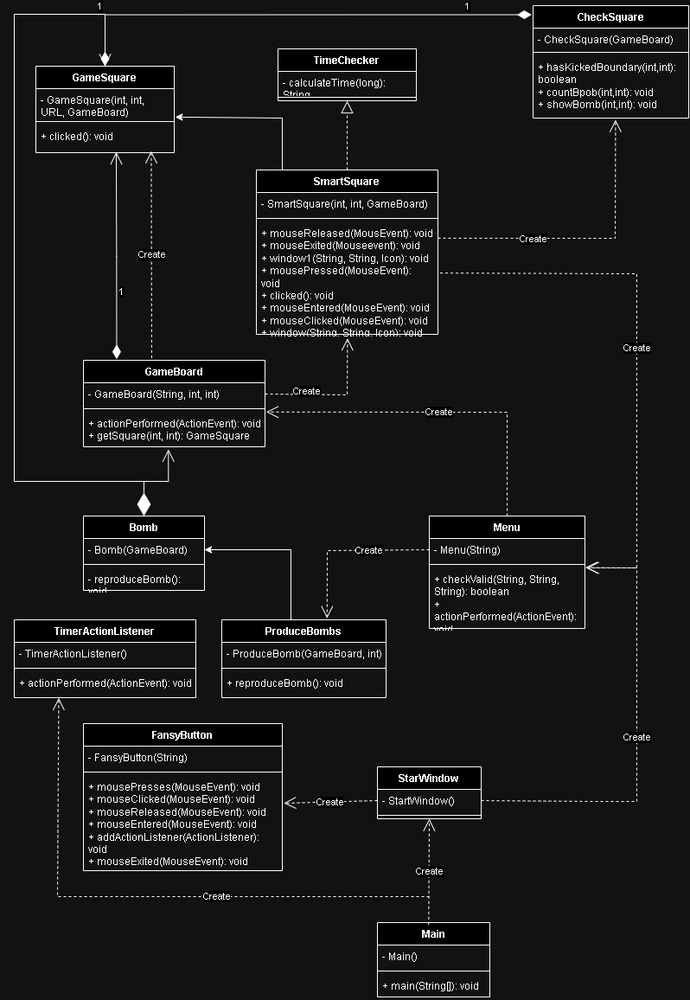
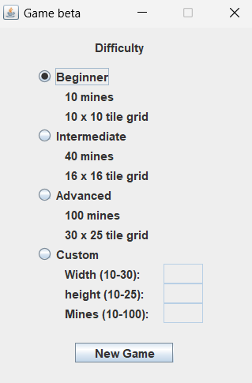
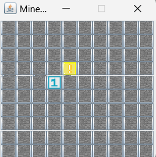
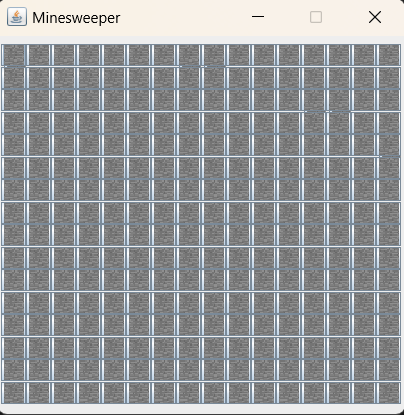
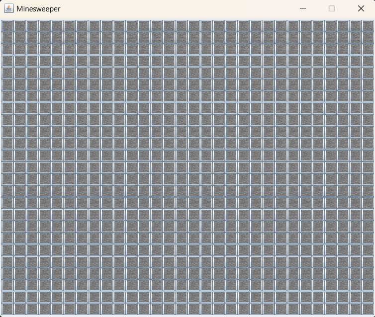
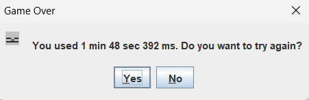
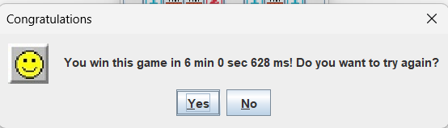

# Minesweeper-DSA-Project
## Introduction
    - This is the Team 6 IT21 Minesweeper DSA final project. Minesweeper, a timeless puzzle game, challenges players to navigate a grid of cells, uncovering safe areas while avoiding hidden mines. It's a test of logic and quick decision-making.
    - In Minesweeper, players are presented with a grid of covered cells, concealing either a safe space or a perilous mine. The objective is to reveal all safe cells without detonating any mines. Each uncovered cell provides valuable information, indicating the number of adjacent mines. Armed with this knowledge, players must strategically deduce the locations of mines and mark them with flags to proceed safely.
## Documentation
### How to play:
- **Left mouse**: start a game. Then based on the numbers you see, you have to figure out where the mines are and secure them with flags, and discover more numbers to find even more mines.
- **Right mouse**: mark a field with flag.
### Features:
- Completed: 
    - Share Mode: Allows players to share their results and achievements on social media platforms to challenge friends.
    - Campaign Mode: Create interactive levels and missions, taking players through a structured and engaging journey
    - Turn back the previous step if click on mine.
    - Skin Change: Gives players the flexibility to change the look and feel of the game, from color themes to icon types.
## Screenshot
### UML
| |
|:---:|
| **UML**|
### Minesweeper Screenshots
| |
|:---:|
| **Configuration Screen**|

| |
|:---:|
| **Beginner Map Screen**|

| |
|:---:|
| **Intermediate Map Screen**|

| |
|:---:|
| **Advanced Screen Screen**|

| |
|:---:|
| **Game Over Popup**|

| |
|:---:|
| **Congratulation Popup**|
## Tech stacks
- Language: [JAVA](https://www.java.com/en/)
- IDEA: [IntelliJ](https://www.jetbrains.com/idea/) [Visual Studio Code](https://code.visualstudio.com/)
- Library: [JavaSwing](https://en.wikipedia.org/wiki/Swing_(Java)) and [JavaAWT](https://en.wikipedia.org/wiki/Abstract_Window_Toolkit)
## Contributing
| Order |          Name          |     ID      |                Task                    | Contribution |
| :---: |:----------------------:|:-----------:|:--------------------------------------:|:------------:|
|   1   | Trần Văn Đạt (leader)  | ITITIU21173 | Github manager, project management     |     25%      |
|   2   |  Nguyễn Phạm Đức Anh   | ITITIU21033 |   Code game, provide new idea          |     25%      |
|   3   |     Phạm Thế Thiện     | ITDSIU20084 |   Code game, fix bugs, presentation    |     25%      |
|   4   |    Trịnh Tiến Đạt      | ITDSIU20109 |   Code game, powerpoint, report        |     25%      |